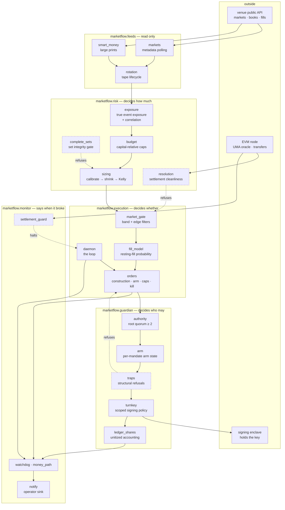

# Architecture

MarketFlow is five layers and one rule: **a layer may only be reached through the one
below it, and nothing above the risk layer may widen a limit set beneath it.** Every
other design choice in this repository follows from taking that rule seriously in a
market where the venue's fee take exceeds the edge on either side of the trade.

## Data and control flow



Dashed edges are refusals. There are four independent places that can stop a trade,
each owning a different question, and none of them can be satisfied by the others:

| Refusal | Question it owns | Cannot be overridden by |
|---|---|---|
| `risk.complete_sets` | can this actually be bought at size? | a better price |
| `risk.resolution` | will this settle on an objective fact? | a larger edge |
| `execution.market_gate` | is the cost structure survivable here? | model confidence |
| `guardian.traps` | is this shape one we refuse regardless of view? | any upstream approval |

## The layers

### feeds — read-only

Polls public market metadata, collects large prints, and owns the lifecycle of the
JSONL tapes both produce. Nothing here authenticates, and nothing here decides
anything. `rotation` exists because an append-only tape that is never rotated becomes
either a disk-full incident or a silent truncation, and both look like "the feed
stopped" long after the fact.

### risk — decides how much

The layer that gives the repository its reason to exist.

`exposure` computes what is genuinely at risk rather than what was paid. Inside a
mutually exclusive group it enumerates every settlement state exactly — no simulation,
no assumption — and takes the worst. Outside one it takes the bound where every leg
loses together and labels it a bound. It also reports an effective number of
independent bets, and a negative correlation concentration is a real result, not an
error: exclusivity is structural diversification.

`budget` turns that into a size. Every limit is a fraction of a declared capital base,
so the same code governs a $50k book and a $500M mandate; only the base changes.

`sizing` is the single place a probability becomes a number of shares, through three
independent haircuts — shrink toward the market, discount by the estimate's own
standard deviation, then a fraction of Kelly — followed by per-market and per-cluster
caps. Each haircut defends against a different failure, and the failure they share is
confidence.

`complete_sets` and `resolution` are refusals rather than sizers. One asks whether an
apparent arbitrage can be bought; the other whether the contract settles on something
objective.

### execution — decides whether

`market_gate` applies the hard probability-band filter and an advisory after-cost edge
test. The band filter is a consequence of the fee geometry, not a preference: under
`rate * p * (1 - p)` the round-trip cost relative to remaining upside explodes at both
ends of the range.

`orders` constructs and submits, and owns the fuses — arm state, caps, the kill file,
idempotency keys. Dry run is the default; a live request without armed state resolves
to dry run rather than raising, because refusing is the safe direction.

`daemon` is the loop that ties a tick together. `fill_model`, `funnel` and
`microstructure` measure how the execution itself performs, which is where most of the
recoverable money in a friction-dominated market actually is.

### guardian — decides who may

The authority boundary. Keys live in a signing enclave under a scoped policy, so the
service can place orders within the mandate and cannot transfer funds out. Root
authority requires a quorum of at least two signers, enforced in `authority` and
asserted by a self-test rather than left to configuration.

`traps` refuses three structural shapes regardless of any view. `ledger_shares` keeps
unitized accounting, which is pure arithmetic and performs no money operation.

The asymmetry inside this layer is deliberate and is the layer's whole point:
**automation may exit a position, and only a person may open one.** `order.py` is the
user-commanded BUY path — it never originates a signal and never suggests what to buy;
a user names the market and the amount, the book is quoted, they confirm, and only then
is an order planned, still bounded by the same traps and the same caps. A structural
trap returns a refusal the user can decline with a recorded reason, which declines the
guard rail without widening any money fuse. Both halves of that are asserted in the
guardian suite.

### monitor — says when it broke

Heartbeat watchdogs on the money path, settlement guards over the UMA oracle, and a
single operator sink with no destination baked in. Everything here is fail-loud:
`money_path` exists because a trading system that silently stops writing looks exactly
like a trading system with nothing to do.

## Trust boundaries

```
┌─ untrusted ────────────────────────────────────────────────────────┐
│  venue API responses · chain reads · any tape collected from them  │
└────────────────────────────────────────────────────────────────────┘
        │ every field parsed defensively; a missing field is a refusal,
        │ never a default that widens a limit
        ▼
┌─ trusted computation ──────────────────────────────────────────────┐
│  feeds → risk → execution.   No credential, no key, no signature.  │
└────────────────────────────────────────────────────────────────────┘
        │ one direction only, through an explicit authority check
        ▼
┌─ authority ────────────────────────────────────────────────────────┐
│  guardian.   Holds no key itself; requests signatures from an      │
│  enclave under a policy that cannot express a withdrawal.          │
└────────────────────────────────────────────────────────────────────┘
```

The important property is the one-way arrow. Analysis never gains the ability to act
by importing something; `marketflow.risk.exposure` proves it from its own syntax tree
and fails its self-test if it ever does.

## Why the boundaries are tests

Documented boundaries rot. These are asserted:

- `risk.exposure` parses itself and fails if it imports anything but the standard
  library and the path resolver, or if any banned identifier is reachable.
- `execution.daemon` counts its own network calls during the self-test and fails if
  one escapes the injected stub — because the call is fail-soft, and a fail-soft call
  hides its own failure.
- `guardian.authority` refuses a single-signature root, with a test.
- `monitor.watchdog` asserts that the execution-state and service-state buckets
  resolve to different directories, because a mirrored heartbeat written to the wrong
  bucket is never read and never reports an error.

## Further reading

[docs/EVOLUTION.md](docs/EVOLUTION.md) is the intellectual history: what was believed,
what contradicted it, and which component exists as a result.
[docs/design-decisions/](docs/design-decisions/) records each hard-to-reverse choice
with what it rules out and what would make it wrong.

## Where state lives

`marketflow.paths` is the only module that computes a project root or a runtime
directory. `MARKETFLOW_RUNTIME` relocates every artefact — ledgers, arm state, caches,
heartbeats — so an installed package never writes beside its own source.
