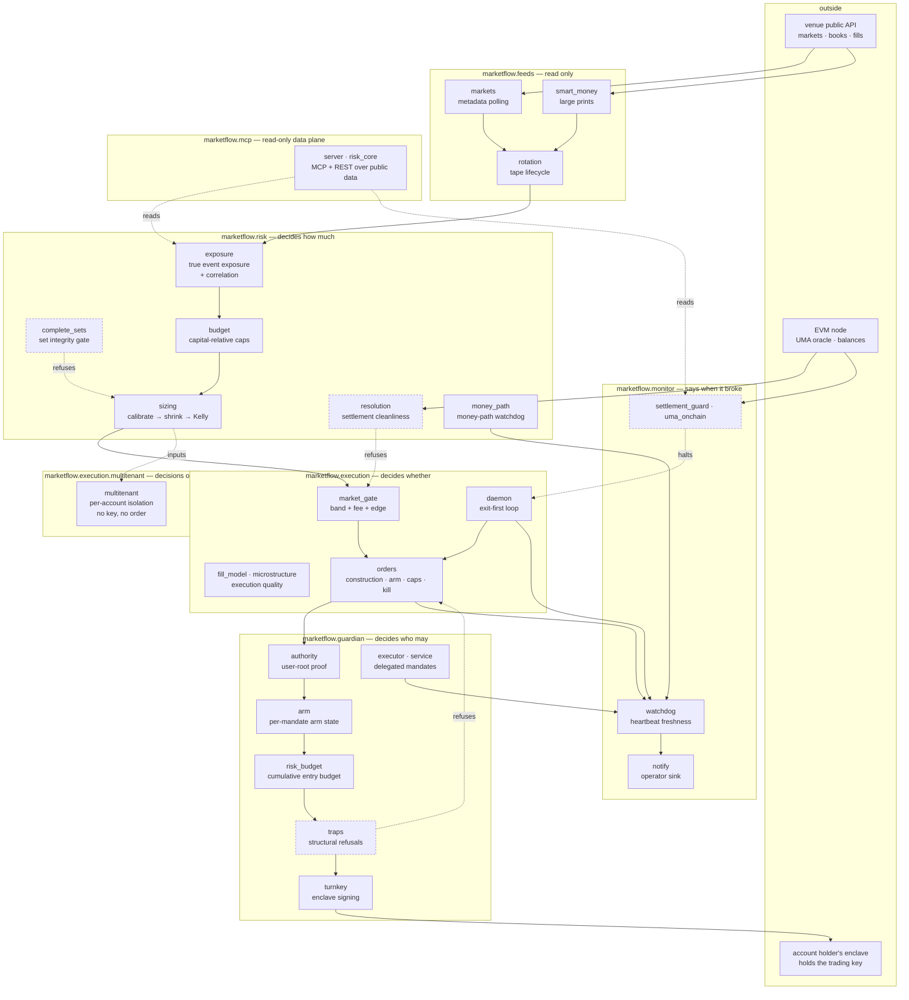

# Architecture

MarketFlow is a read-only research and data plane, a risk layer that decides how much
may be at risk, an execution layer that decides whether a specific order may be placed,
and a guardian layer that decides who may place it. The rule that holds it together is
that **data flows one way** — feeds → risk → execution — and that **authority is a
separate axis**, reachable only through a validated proof and never through an import.

## Data and control flow



Dashed edges are refusals (and, for `multitenant`, an input edge). Four independent
places can stop a trade, each owning a different question, and none of them can be
satisfied by the others:

| Refusal | Question it owns | Cannot be overridden by |
|---|---|---|
| `risk.complete_sets` | can this actually be bought at size? | a better price |
| `risk.resolution` | will this settle on an objective fact? | a larger edge |
| `execution.market_gate` | is the cost of expressing this view survivable? | model confidence |
| `guardian.traps` | is this shape one we refuse? | anything, including a stated reason |

## The layers

### feeds — read-only

Polls public market metadata, collects large prints, and owns the lifecycle of the
JSONL tapes both produce. Nothing here authenticates, and nothing here decides
anything. `rotation` exists because an append-only tape that is never rotated becomes
either a disk-full incident or a silent truncation, and both look like "the feed
stopped" long after the fact.

### risk — decides how much

`exposure` computes what is genuinely at risk rather than what was paid. Inside a
mutually exclusive group it enumerates every settlement state exactly — no simulation,
no assumption — and takes the worst. Outside one it takes the bound where every leg
loses together and labels it a bound. It also reports an effective number of
independent bets, and a negative correlation concentration is a real result, not an
error: exclusivity is structural diversification. This module parses its own syntax
tree and fails its self-test if it ever imports the execution stack.

`budget` turns that into a size. Every limit is a fraction of a declared capital base,
so the same code governs a small book and a large mandate; only the base changes.
Where it needs the authoritative definition of a cap it imports it from
`execution.orders` rather than restating it, so one module owns that number.

`sizing` is the single place a probability becomes a number of shares, through three
independent haircuts — shrink toward the market, discount by the estimate's own
standard deviation, then a fraction of Kelly — followed by per-market and per-cluster
caps. Each haircut defends against a different failure, and the failure they share is
confidence.

`complete_sets` and `resolution` are refusals rather than sizers. One asks whether an
apparent arbitrage can be bought; the other whether the contract settles on something
objective. `money_path` watches the money path for silence — a trading system that
stops writing looks exactly like one with nothing to do.

### execution — decides whether

`market_gate` applies the hard probability-band filter and an advisory after-cost edge
test. The band's two ends have different justifications: the low end encodes a measured
loss in the frozen ledger, the high end is a risk-shape default. An unreadable fee rate
does not authorize a live taker order — it is refused.

`orders` constructs and submits, and owns the fuses — arm state, caps, the kill file,
idempotency keys. Dry run is the default; a live request without armed state resolves
to dry run rather than raising, because refusing is the safe direction. `daemon` is the
loop that ties a tick together, exits first: a SELL is never blocked by an entry gate.
`multitenant` runs the same decision rules over many accounts, each in its own file
namespace, and produces decisions only — it holds no key and calls no order function.
`fill_model` and `microstructure` measure how the execution itself performs, which is
where most of the recoverable money in a friction-dominated market actually is.

### guardian — decides who may

The authority boundary, and the only place a signature is ever requested. A delegated
mandate is a sub-organization the account holder controls: their root quorum holds the
account, the trading key lives in that sub-organization's enclave, and this service
holds only the API credentials of two side-bound agents — an entry agent that may sign
BUYs and an exit agent that may sign SELLs. Before every arm and every signature,
`authority` re-validates a fresh read-only proof that all of that is still true; the
root quorum must be at least two signers, enforced in code and asserted by a self-test.
`risk_budget` reserves each live entry against a cumulative limit before the order is
built, and `executor` refuses a live entry that has no reservation.

Within guardian, a structural trap is a **non-overrideable refusal**: `traps` runs
three rules, a rule in enforce mode stops the order, and there is no path that buys it
anyway. An earlier revision allowed a stated reason to decline the rail; the rail now
exists as a hard boundary, which keeps "this is a refusal" and "this is a preference"
distinguishable. Only automation calls it, so nobody is at a keyboard to take an
override in the first place.

`turnkey` is the signing layer: one activity type, side-bound policies, and a local
refusal of the fund-moving message shape before a request is ever built.

### monitor — says when it broke

Heartbeat watchdogs on the money path and the execution daemon, settlement guards over
the oracle — the proposal direction read on chain rather than from a lagging metadata
field — and a single operator sink with no destination baked in. Everything here is
fail-loud: an alert that could not be delivered reports that it could not, rather than
claiming success.

### mcp — a read-only data plane

`server` exposes public market data, settlement-risk factors and recent large prints as
MCP tools plus a small REST surface. It reaches into `risk` and `monitor` for the same
primitives the system uses, holds no credential, and cannot touch arm state, caps or
any execution path. In the dependency direction this is a leaf: nothing imports it.

## Trust boundaries

```
┌─ untrusted ────────────────────────────────────────────────────────┐
│  venue API responses · chain reads · any tape collected from them  │
└────────────────────────────────────────────────────────────────────┘
        │ every field parsed defensively; a missing field is a refusal,
        │ never a default that widens a limit
        ▼
┌─ trusted computation ──────────────────────────────────────────────┐
│  feeds → risk → execution.   No credential, no key, no signature.  │
└────────────────────────────────────────────────────────────────────┘
        │ one direction only, through an explicit authority check
        ▼
┌─ authority ────────────────────────────────────────────────────────┐
│  guardian.   Holds no wallet key: it holds an agent credential     │
│  whose enclave policy can sign one order shape on one side, and    │
│  cannot express a transfer. The account holder's root controls     │
│  the account, and the service is not a member of that quorum.      │
└────────────────────────────────────────────────────────────────────┘
```

The important property is the one-way arrow. Analysis never gains the ability to act by
importing something; `marketflow.risk.exposure` proves it from its own syntax tree and
fails its self-test if it ever does.

## Why the boundaries are tests

Documented boundaries rot. These are asserted:

- `risk.exposure` parses itself and fails if it imports anything but the standard
  library and the path resolver, or if any banned identifier is reachable.
- `execution.daemon` counts its own network calls during the self-test and fails if one
  escapes the injected seams — because the calls are fail-soft, and a fail-soft call
  hides its own failure.
- `guardian.authority` refuses a single-signature root, an unready wallet and any
  policy flag that would allow a transfer, batch or export, with tests.
- `guardian.turnkey` refuses the fund-moving message shape locally, appends only one
  activity type, and refuses any tenant record that is not a user-root delegation.
- `guardian.selftest` asserts that a live entry with no risk-budget reservation never
  reaches a client, and that a record naming any other signing backend is refused.
- `monitor.watchdog` asserts that its own state and the heartbeats it reads resolve to
  different directories, because a mirrored heartbeat written to the wrong bucket is
  never read and never reports an error.

## Further reading

[docs/EVOLUTION.md](docs/EVOLUTION.md) is the intellectual history: what was believed,
what contradicted it, and which component exists as a result.
[docs/design-decisions/](docs/design-decisions/) records each hard-to-reverse choice
with what it rules out and what would make it wrong.

## Where state lives

`marketflow.paths` is the only module that computes a project root or a runtime
directory. `MARKETFLOW_RUNTIME` relocates every artefact — ledgers, arm state, caches,
heartbeats — so an installed package never writes beside its own source.
